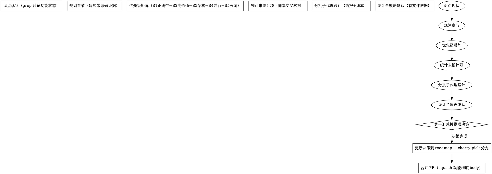

# roadmap 功能规划与批量设计

> 适用于 sproxy（及其他 Go 仓库）：把「规划下一个 roadmap + 全量设计」做成可复用流程。
> 核心：**每项规划必须有设计文件作为依据**；设计由子代理批量产出；决策统一汇总；只设计不实现。

## 核心原则

1. **现状盘点先行**：规划前逐项 grep 验证「已落地/已规划/待设计」——roadmap 状态必须可复现（带源码行号证据）。
2. **每项规划必须有设计文件**：roadmap 功能项数 ≠ 已设计数——用脚本统计交叉核对，缺项按批次补齐。
3. **本 agent 只设计，其他 agent 实现**：设计文档是实现的唯一输入（含片划分/变异点/零回归）。
4. **决策统一汇总**：全部设计完成后一次性提问（分组 ≤4 题），避免逐项中断。
5. **合并纪律**：docs-only 走 docs/roadmap-next 分支 + PR squash（body 按功能维度），**绝不直接提交 master**。

## 何时使用

- 收到「规划下一个 roadmap / 分析还有哪些能力缺失 / 继续深化规划」类需求
- 已有功能审查完成，需把新方向转成可执行的实现蓝图
- 需要为多个规划项批量产出设计文档（子代理并行）

## 流程



## 子代理批量设计（核心模式）

### 简报 = 需求唯一来源（必须）

每路子代理一份简报（`.design-ledger/task-<批>.md`），含：
1. **严格约束**：禁 web_search / 只读精确路径 / 每份 ≤100-150 行
2. **精确源码路径**：列出待读文件（**绝不**让子代理猜文件名）
3. **现状核实**：已确认的事实（避免子代理重复调研）
4. **设计要点**：每项功能的目标/接口/测试要求
5. **产出路径**：`docs/designs/<日期>-<功能>.md`
6. **报告契约**：只回传状态 + 文件路径 + 测试摘要

### 分派提示词模板

```
你是 <repo> 的功能设计子代理。对以下 N 个功能进行头脑风暴设计。
## 严格约束
1. 禁止 web_search / fetch_content——只读本地源码
2. 只读简报列出的精确文件路径（不要猜文件名）
3. 产出 N 份设计文档，每份 ≤100 行
## 第一步：读简报 <path>（需求唯一来源）
## 第二步：读源码（简报列的）
## 第三步：写设计文档 <paths>
每份含：背景/目标、组件与接口、数据流、错误处理、测试+变异点、片划分、风险与零回归
## 报告：写回 <report-path>
```

### 子代理超时反模式（实证教训）

| 失败模式 | 根因 | 修复 |
|---------|------|------|
| Read 反复 ENOENT 拖死 | 子代理猜文件名（如 metrics_slo.go 不存在） | 简报精确列出路径，禁猜名 |
| web_search 搜错项目 | 被同名项目干扰（sbproxy ≠ sproxy） | 简报明确禁网络工具 |
| 单路范围过大超时 | 一次 5 项 + 每份 150 行 | 每路 ≤3 项 + 行数上限 |

### 账本（.design-ledger/progress.md）

记录每个子代理：ID / 功能 / 产出文件 / 状态（在途/已返回/超时重派）。账本是恢复地图——子代理结果原生通知，不轮询。

## 设计文档结构（每份）

```
# <功能>设计（<日期>）
## 背景 / 目标      # 现状（带源码证据）+ 目标
## 组件与接口       # 新包/文件/接口/配置
## 数据流          # 时序
## 错误处理         # 状态码/失败语义/fail-closed
## 测试 + 变异点    # TDD 用例 + 变异后必须红
## 片划分          # P1/P2/P3 + 依赖
## 风险与零回归保证  # 默认关闭/旧行为不变
```

## 决策汇总

- 全部设计完成后收集各设计的「待决断项」→ 统一 ask_user_question（每批 ≤4 题，每题 2-4 选项，推荐项置首）
- 决策记录追加到 roadmap 对应节（「人工决策」段）
- 不中断：全部决策完才继续（不逐项问）

## 合并纪律（硬性）

1. 设计/roadmap 改动**绝不直接提交 master**——先提交到 `docs/roadmap-next` 分支（worktree）
2. cherry-pick 设计文档到分支 → 更新 PR title/body（功能维度）
3. docs-only 通道 CI 秒绿 → `gh pr merge --squash`（body 用功能维度：规划→设计→决策）
4. 合并后 `git reset --hard origin/master` 对齐本地 master
5. 清理分支/worktree

## 常见错误

| 错误 | 修复 |
|------|------|
| 17 份设计当「全覆盖」——实际 82 项 | 脚本统计功能项 vs 设计文件，缺口分批补 |
| 子代理猜文件名 | 简报精确路径 + 禁猜 |
| 直接提交 master | 走分支 + cherry-pick + reset 对齐 |
| 决策逐项问 | 汇总后一次问（≤4 题/批） |
| roadmap 误记「已有」（/api/events 实际不存在） | 子代理源码核验 + 设计纠正 |

## 参考

- roadmap 权威文档：`docs/roadmap.md`（第 11 章 = 本次规划的 11.1-11.14）
- 设计文档：`docs/designs/`（62 份，roadmap 82 项全覆盖）
- 设计账本/简报：`.worktrees/docs/design-batch/.design-ledger/`
- 子代理技能：`subagent-driven-development`（实现阶段用）；`sproxy-docs-lifecycle`（文档收敛）
